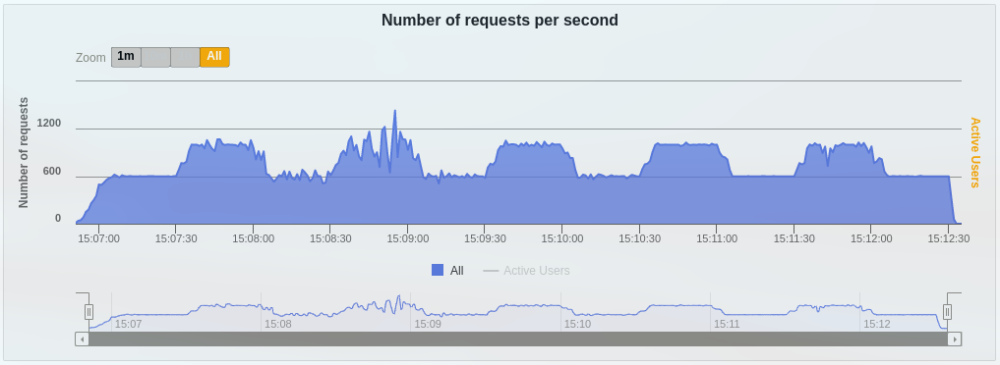
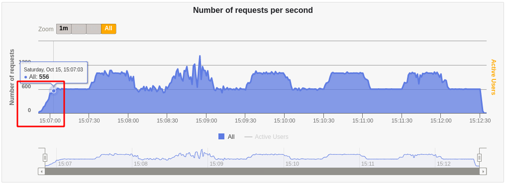
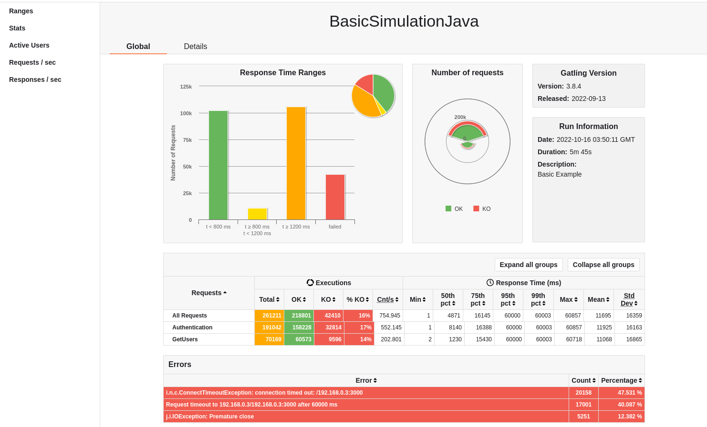

[](https://github.com/prettier/prettier)

# Spike testing using Gatling (Scala)

Related projects (branches):
- [Performance testing using Gatling](https://github.com/eccanto/base-gatling-performance-testing)
- [Load testing using Gatling (Scala)](https://github.com/eccanto/base-gatling-performance-testing/tree/feature/load-testing-scala)
- [Load testing using Gatling (Java)](https://github.com/eccanto/base-gatling-performance-testing/tree/feature/load-testing-java)
- [Stress testing using Gatling (Scala)](https://github.com/eccanto/base-gatling-performance-testing/tree/feature/stress-testing-scala)
- [Stress testing using Gatling (Java)](https://github.com/eccanto/base-gatling-performance-testing/tree/feature/stress-testing-java)
- [Spike testing using Gatling (Scala)](https://github.com/eccanto/base-gatling-performance-testing/tree/feature/spike-testing-scala) `[current branch]`
- [Spike testing using Gatling (Java)](https://github.com/eccanto/base-gatling-performance-testing/tree/feature/spike-testing-java)

# Table of contents

* [Overview](#overview)
  * [Objetive](#objetive)
  * [Scenario](#scenario)
* [Get started](#get-started)
  * [Requirements](#requirements)
  * [Run](#run)
* [License](#license)

# Overview

## Objetive

The system will be tested with a load of `600` requests per second with load increases to `1000` requests periodically
from `10` Gatling **workers** during ~ 5 minutes and 40 seconds (each worker will execute `60` and `100` requests per
second respectively). The system will load beyond its peak capacity periodically to the point of failure.

Simulation example:



Configuration:
- `SIMULATION_CYCLES`: 5 cycles (maximum peaks).
  

- `SIMULATION_REACH_SECONDS`: 10 seconds, initial gradual loading time.
  

- `SIMULATION_CYCLE_SECONDS`: 30 seconds, duration of each interval.
  

- `SIMULATION_MINIMUM_PEAK`: 60 requests (in each worker, 600 in total).
  

- `SIMULATION_MAXIMUM_PEAK`: 100 requests (in each worker, 1000 in total).
  

## Scenario

The following Scala code represents our stress testing Gatling example:

```scala
class BasicSimulationScala extends Simulation {
    val SERVER_HOST = sys.env.get("SERVER_HOST").get                                      // (1)
    val API_USERNAME = sys.env.get("API_USERNAME").get                                    // (1)
    val API_PASSWORD = sys.env.get("API_PASSWORD").get                                    // (1)

    val SIMULATION_CYCLES = sys.env.get("SIMULATION_CYCLES").get.toInt                    // (2)
    val SIMULATION_REACH_SECONDS = sys.env.get("SIMULATION_REACH_SECONDS").get.toInt      // (2)
    val SIMULATION_CYCLE_SECONDS = sys.env.get("SIMULATION_CYCLE_SECONDS").get.toInt      // (2)
    val SIMULATION_MINIMUM_PEAK = sys.env.get("SIMULATION_MINIMUM_PEAK").get.toInt        // (2)
    val SIMULATION_MAXIMUM_PEAK = sys.env.get("SIMULATION_MAXIMUM_PEAK").get.toInt        // (2)

    val httpProtocol = http.baseUrl(SERVER_HOST)

    val test_case = scenario("BasicSimulationScala")
        .exec(                                                                            // (3)
            http("Authentication")                                                        // (3)
                .get("/api/token")                                                        // (3)
                .basicAuth(API_USERNAME, API_PASSWORD)                                    // (3)
                .check(status.is(200))                                                    // (3)
                .check(jsonPath("$.access").saveAs("jwt_token"))                          // (3)
        )                                                                                 // (3)
        .exitHereIfFailed
        .exec(                                                                            // (4)
            http("GetUsers")                                                              // (4)
                .get("/api/users")                                                        // (4)
                .header("Authorization", "JWT ${jwt_token}")                              // (4)
                .check(status.is(200))                                                    // (4)
        )                                                                                 // (4)

    var simulation_cycle = List(                                                          // (5)
        reachRps(SIMULATION_MINIMUM_PEAK).in(SIMULATION_REACH_SECONDS.seconds),           // (5)
        holdFor(SIMULATION_CYCLE_SECONDS.seconds)                                         // (5)
    )                                                                                     // (5)

    for(interval <- 0 until SIMULATION_CYCLES)                                            // (6)
    {                                                                                     // (6)
        simulation_cycle = simulation_cycle :+ jumpToRps(SIMULATION_MAXIMUM_PEAK)         // (6)
        simulation_cycle = simulation_cycle :+ holdFor(SIMULATION_CYCLE_SECONDS.seconds)  // (6)
        simulation_cycle = simulation_cycle :+ jumpToRps(SIMULATION_MINIMUM_PEAK)         // (6)
        simulation_cycle = simulation_cycle :+ holdFor(SIMULATION_CYCLE_SECONDS.seconds)  // (6)
    }                                                                                     // (6)

    setUp(
        test_case.inject(
            constantUsersPerSec(SIMULATION_MAXIMUM_PEAK).during(
                (SIMULATION_REACH_SECONDS + SIMULATION_CYCLE_SECONDS + (SIMULATION_CYCLES * SIMULATION_CYCLE_SECONDS * 2)).seconds
            )
        )
    )
    .throttle(
        simulation_cycle:_*
    )
    .protocols(httpProtocol)
}
```

- `(1)`: Gets server host and credentials.
- `(2)`: Gets the configuration variables (defined in the [docker-compose.yml](./docker-compose.yml)).
- `(3)`: Log in and gets the JWT from the server.
- `(4)`: Task to obtain users data from the server.
- `(5)`: Defines the first part of the simulation, the number of requests gradually increases.
- `(6)`: Defines the simulation intervals that emulate low and high peak loads repeatedly.

# Get Started

## Requirements

- [Docker +20.10](https://docs.docker.com/engine/install/ubuntu/)
- [docker-compose +1.29](https://docs.docker.com/desktop/install/linux-install/)

## Run

1. Run [REST API server mock](https://github.com/eccanto/base-mockoon-api-rest-server-mock) (address: http://localhost:3000).
2. Edit [mock_variables.env](./mock_variables.env):
    ```bash
    # CHANGE!: Change <LOCAL_IP>, this IP must be accessible from within a gatling containers.
    SERVER_HOST=http://<LOCAL_IP>:3000
    API_USERNAME=test
    API_PASSWORD=test
    ```
3. Run Gatling docker containers (with `10` workers):
    ```bash
    docker-compose up --scale worker=10
    ```
4. The Gatling report file is saved in `results/reports/index.html`.
    
    

# License

[MIT](./LICENSE)
